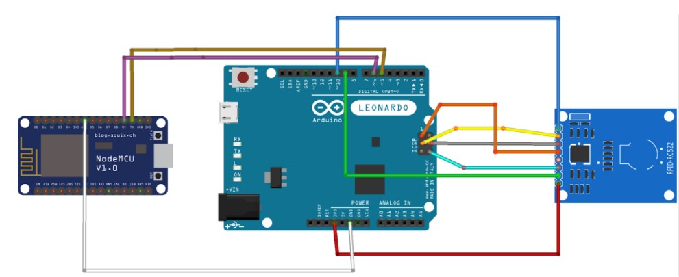

# rfid-authentication
IoT and Cloud Enabled PC authentication using RFID tag with user login audit in the Client Device.
### Prerequisites: 
* IoT devices:
  * Arduino Leanardo (any Board that supports Keyboard library) - PC Authentication
  * Node MCU Esp8266 - Logging using the wifi
  * RC522 RFID Reader
  * RFID Tags
* Cloud services: 
  * Firebase Real-Time Database - store logs
  * Firebase Cloud Messaging - notify the app
  * Pusher Beams Client - api to send push notifications using the FCM server
  * AWS EC2 - EC2 server to host the python script to automate the notifications
* Android Studio - Build & Compile the android application

### Circuit Diagram:

